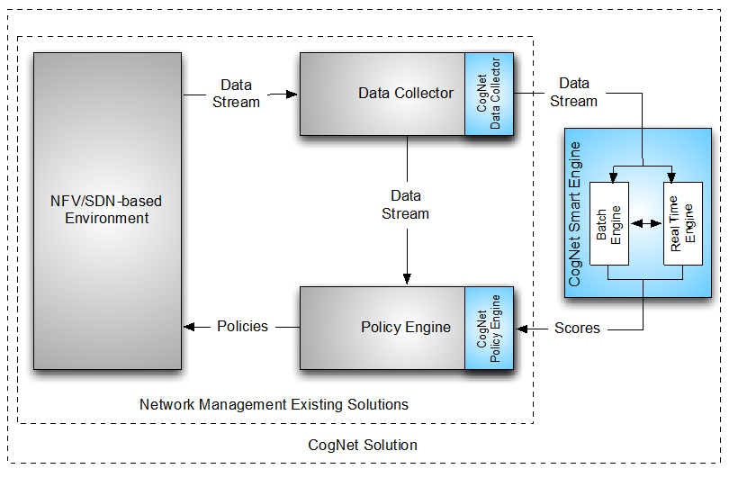
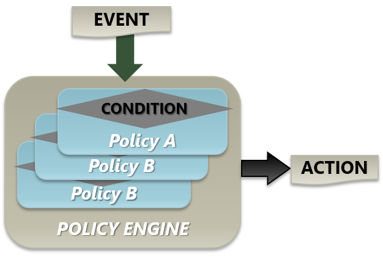
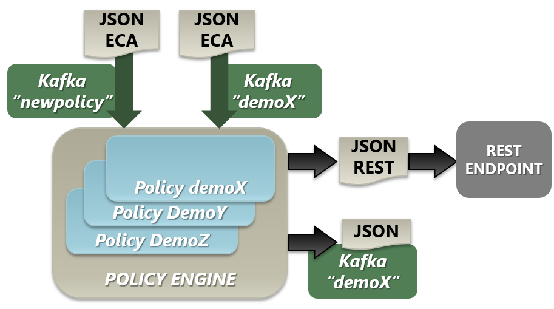
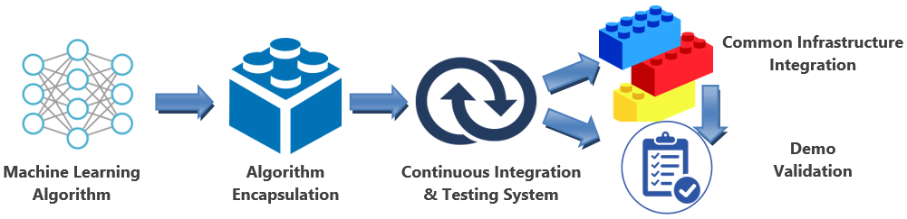
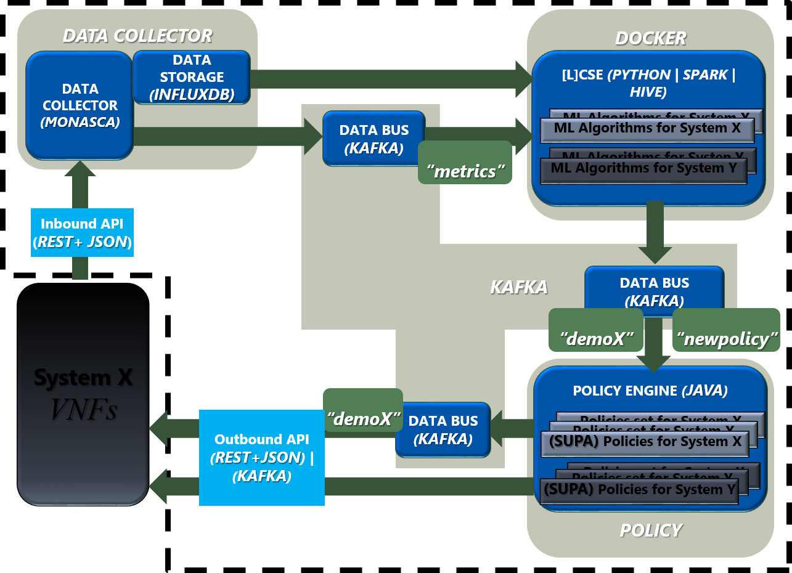

[Integration Overview][] | [CogNet Overview][] | [Processing modes of Machine Learning algorithms][] | [Policy Engine workflow][] | [Common Infrastructure Integration][] | [Machine Learning in the Common Infrastructure ecosystem][]

[Useful links][] | [FAQ][]

[Integration general steps][] | [Connectivity][] | [Repository][] | [Data Ingest][] | [Apache Kafka][] | [Policy Engine][] | [Dockers][] | [Monasca][] 

 
# Public demos repository


The main data compiled inside this repository includes:
* all the files employed in the different demos with a specific structure to be employed by the Jenkins system to deploy and exercise the demo [https://github.com/CogNet-5GPPP/CogNet_services/tree/master/demos/Dockers](https://github.com/CogNet-5GPPP/CogNet_services/tree/master/demos/Dockers)
* a set of sample codes to integrate a demo on top of the CogNet Common Infrastructure [https://github.com/CogNet-5GPPP/CogNet_services/tree/master/demos/Dockers](https://github.com/CogNet-5GPPP/CogNet_services/tree/master/demos/Dockers)
* a set of tools to debug and log the components involved in a demo [https://github.com/CogNet-5GPPP/CogNet_services/tree/master/tools](https://github.com/CogNet-5GPPP/CogNet_services/tree/master/tools)

This file also contains the F.A.Q. about CogNet common infrastructure

# Integration Overview

## CogNet Overview

The CogNet control loop for the different demonstrators includes data capturing, data processing and decision recommendation consequently.



CogNet processing is executed in two separate phases:
1. The [Lightweight] CogNet Smart Engine ([L]CSE) is the logical module that contains the Machine Learning algorithms.
2. The CogNet Policy Engine is being used to evaluate the output from the [L]CSE to determine if any thresholds have been violated and execute the appropriate actuation on the network to resolve the predicted (or currently active) issue.

## Processing modes of Machine Learning algorithms

The [L]CSE can get the time series of measures in a JSON format for 2 different regimes:

* Batch Processing: the HTTP API endpoint of the InfluxDB time series database.
* Stream Processing: the Kafka messaging subscription.

## Policy Engine workflow

SUPA ECA tree expresses policies:
* Events (Triggers coming from [L]CSE)
* Conditions (Rules applied to Event values by the Policy Engine)
* Actions (Actuation from the Policy Engine when satisfying Conditions)



2 different inputs comes from the [L]CSE to the Policy Engine:
1. A definition of a new policy comes in a SUPA ECA document through the “newpolicy” topic.
The Policy Engine component accepts requests from the [L]CSE to build and deploy a policy based framework that will accept machine learning scores from the CSE. Internally, the definition pushed through “newpolicy” topic generates a Policy A Java class. 
2. A ML score published by the [L]CSE comes in a SUPA ECA document through the “demoX”, for example, topic.
Once the Policy Engine Instance (PMI) has been deployed the [L]CSE forwards all of its resultants scores (plus metadata for that score) to its PMI when the score is then analysed for any violations. Once it is generated is automatically executed listening to a specific Kafka topic (“demoX” in this case). Every update of the Event in the SUPA ECA document coming to the “demoX” topic will be evaluated by the listening Policy instance and, when the condition satisfied, the Policy performs a REST request to the “action-host” endpoint including the “action-param” body from the SUPA ECA document or pushes the “action-param” JSON to the “demoX” Kafka topic if "action-host" is a void parameter ("").



Each demonstrator brings a [L]CSE tuned to intrinsic features from the metrics and with a range of possible actions to be triggered accordingly.
The metrics ingest and the action recommendation are embodied in Apis which decouple the CogNet control loop from the analysed and optimized system.

## Common Infrastructure Integration

In order to make all the demonstrators proceed the same way with the integration and evaluation of the different demonstrators on top of the common infrastructure, an encapsulation procedure has been defined to be used in the continuous integration and testing system, Jenkins.



The integration and evaluation procedure, for all the demonstrators, establishes:
* the interface system: based on Jenkins and Ansible playbooks, 
* encapsulation format: using Dockers to instantiate a full running stack and 
* communication technology: making Kafka the common data bus.

## Machine Learning in the Common Infrastructure ecosystem

The CogNet Common Infrastructure is a set of resources that enables experimentation over a common testbed.



Here:
* the logic components, in blue, are arranged over the hostnames of the testbed machines,
* the technologies involved are inside the brakets,
* the interfaces are illustrated by green arrows.

This way, the integration of a working demo has to follow this general steps:

1. Update your [L]CSE code to initialize the policy that will listen to their results sending a SUPA ECA document to the Kafka "newpolicy" topic
2. Update your [L]CSE code to use the established interface to get data. InfluxDB for Batch processing or Kafka "metrics" topic for stream mode
3. Update your [L]CSE code to push ML results to the policy that is listening, sending a SUPA ECA document to the Kafka "demoX" topic
4. Compile the [L]CSE in a Docker image
5. Create and Ansible playbook to deploy and run the [L]CSE
6. Submit all the files to the CogNet_services github following the established file structure and guidelines [https://github.com/CogNet-5GPPP/CogNet_services/tree/master/demos/Dockers](https://github.com/CogNet-5GPPP/CogNet_services/tree/master/demos/Dockers)
7. Setup in Jenkins the playbook to exercise de demo
8. Check the activity in the Policy Monitor

# Useful links

* Current hostame/IP file comprising all the machines in the Common Infrastructure: [hosts](hosts)
* Policy Engine Monitor: [http://[policyIPaddress_from_hosts_file]/logger/](http://[policyIPaddress_from_hosts_file]/logger/)
* CogNet Common Infrastructure: [https://github.com/CogNet-5GPPP/Agnostic_Cloud_CI_public](https://github.com/CogNet-5GPPP/Agnostic_Cloud_CI_public)
* Ansible helloworld: [https://github.com/CogNet-5GPPP/CogNet_Apis/tree/master/helloworlds/ansible](https://github.com/CogNet-5GPPP/CogNet_Apis/tree/master/helloworlds/ansible)
* Influxdb helloworld: [https://github.com/CogNet-5GPPP/CogNet_Apis/tree/master/helloworlds/influxdb](https://github.com/CogNet-5GPPP/CogNet_Apis/tree/master/helloworlds/influxdb)
* Kafka helloworld: [https://github.com/CogNet-5GPPP/CogNet_Apis/tree/master/helloworlds/kafka](https://github.com/CogNet-5GPPP/CogNet_Apis/tree/master/helloworlds/kafka)
* Monasca helloworld: [https://github.com/CogNet-5GPPP/CogNet_Apis/tree/master/helloworlds/monasca](https://github.com/CogNet-5GPPP/CogNet_Apis/tree/master/helloworlds/monasca)
* Create new policy helloworld: [https://github.com/CogNet-5GPPP/CogNet_Apis/tree/master/helloworlds/policy](https://github.com/CogNet-5GPPP/CogNet_Apis/tree/master/helloworlds/policy)
* Some basic tools:[https://github.com/CogNet-5GPPP/CogNet_services/tree/master/tools](https://github.com/CogNet-5GPPP/CogNet_services/tree/master/tools)


# F.A.Q.

## Which are the general steps to be done to integrate the [L]CSE in the CogNet Common Infrastructure?

Follow these steps:

1. Push data to the data collector. This means to:
* push data to Monasca [https://github.com/CogNet-5GPPP/CogNet_Apis/tree/master/helloworlds/monasca](https://github.com/CogNet-5GPPP/CogNet_Apis/tree/master/helloworlds/monasca)
* push data to Kafka "metrics" topic [https://github.com/CogNet-5GPPP/CogNet_Apis/tree/master/helloworlds/kafka](https://github.com/CogNet-5GPPP/CogNet_Apis/tree/master/helloworlds/kafka)
* push data to InfluxDB  [https://github.com/CogNet-5GPPP/CogNet_Apis/tree/master/helloworlds/influxdb](https://github.com/CogNet-5GPPP/CogNet_Apis/tree/master/helloworlds/influxdb)

2. Modify the Machine Learning algorithm to get data accordingly from Kafka "metrics" topic or from InfluxDB depending if your code is working in batch or streaming mode.
You have to get data from the data collector. This means to:
* get data from Kafka "metrics" topic [https://github.com/CogNet-5GPPP/CogNet_Apis/tree/master/helloworlds/kafka](https://github.com/CogNet-5GPPP/CogNet_Apis/tree/master/helloworlds/kafka)
* get data from InfluxDB  [https://github.com/CogNet-5GPPP/CogNet_Apis/tree/master/helloworlds/influxdb](https://github.com/CogNet-5GPPP/CogNet_Apis/tree/master/helloworlds/influxdb)

_Monasca will automatically push every incoming data to InfluxDB and Kafka "metrics" topic_

3. Define a SUPA ECA document expressing the Policy you want to deploy. Take care of the topicName "demoX" you use because it specifies the data bus that you will use to communicate your [L]CSE and the Policy Engine

4. Modify the Machine Learning algorithm to get data accordingly from Kafka "demoX" topic or from InfluxDB depending if your code is working in batch or streaming mode.

5. Packetize your ML algorithm into a Docker following the files structure of the samples in your repo, for example: [https://github.com/CogNet-5GPPP/CogNet_services/tree/master/demos/Dockers](https://github.com/CogNet-5GPPP/CogNet_services/tree/master/demos/Dockers)

6. Create and Ansible playbook to deploy and run the [L]CSE following the sample in your repo, for example: [https://github.com/CogNet-5GPPP/CogNet_services/tree/master/demos/Dockers](https://github.com/CogNet-5GPPP/CogNet_services/tree/master/demos/Dockers)

7. Submit all the code and files to Github following the sample in your repo, for example: [https://github.com/CogNet-5GPPP/CogNet_services/tree/master/demos/Dockers](https://github.com/CogNet-5GPPP/CogNet_services/tree/master/demos/Dockers)

8. Setup in Jenkins the playbook to exercise de demo following the example from [https://github.com/CogNet-5GPPP/CogNet_Apis/tree/master/helloworlds/ansible](https://github.com/CogNet-5GPPP/CogNet_Apis/tree/master/helloworlds/ansible)

## Connectivity

### Which ones are the IP addresses and how I have to refer to other machines/CogNet components?
All the IP addresses are in the hosts file in this repository [hosts](hosts). Most of the times the machines has already configured to use just the hostname, not the IP address.

### How to access to a specific machine to install things or to configure something specific?
You should not do this way. You have to use the Jenkins system, the ansible playbooks, the Docker images and the defined procedure.
The machines has SSH access enabled **exclusively** for management, maintenance or in cases where the only way to proceed is granting direct access. In other words, **do not use this SSH access without explicit awareness of Vicomtech and WIT/TSSG maintenors**.

## Data Ingest

### How can I feed my ML algorithm with data?
You have two options, depending on the way your ML algorithm works. Those working in batch mode taking all the dataset at once and exercising the ML algorithm, should go to InfluxDB. Those working in streaming mode taking the data as they come, should go to Kafka metrics topic.

## Apache Kafka

### Which is the Kafka topic to feed the ML algorithm with incoming data?
Only "metrics" Kafka topic should be used by the different demos to get data from the data collector or their infrastructures or setups. Others can be used but this is the only official incoming data bus for the CogNet Common Infrastructure

### Have the ML algorithm to filter the target data from the incoming ones?
Yes, it has to. If the sample code is followed you could see a callback everytime any new data comes. So the ML algorithm needs an extra condition to check if the JSON contains the specific metric or target data. This could be unefficient but it avoids the data bus silos. In order to gain efficiency the different demos can be executed/arranged in a non-concurrent way.

### Kafka topic to communicate ML algorithm with Policy Engine
Each demo should use just one non existing Kafka topic for all the dataflows between the ML and the Policy Engine. I would recommed to you to use the nickname of the demo or the related scenario

### Which topics are defined in Kafka?

By default only two topics are *reserved* from Kafka for general purposes of CogNet Common Infrastructure:

* metrics - to feed data to the [L]CSE ML algorithm processing data un a streaming mode
* newpolicy - to fire the generation of a Policy java class and its deployment in the Policy Engine waiting for [L]CSE stimulus

### How to check which topics are been used in Kafka?

There is a little python script to check that, please install *pykafka* as *pip* dependency package:

(kafka is kafka hostname)

```
from pykafka import KafkaClient

client = KafkaClient(hosts="kafka:9092")

print(client.topics)
```

### How to check metrics messages from Kafka?

Here we can see a simple python example to read metrics messages from "metrics" topic. Have to install *kafka-python* as pip dependency.

```
from kafka import KafkaConsumer
from kafka import KafkaProducer
from random import randint


random_number=randint(0,999999)
groupId="%s"%(random_number)
consumer = KafkaConsumer('metrics',bootstrap_servers=["kafka:9092"],group_id=groupId)


for message in consumer:
		print(message.value)
```

## Policy Engine

### How policies stuff plays into my demo?
The policy is the entity which translates the outcomes from the ML into actuations in a uniform way _being compliant with CogNet dataflow_.

### How the policy is executed?
There is a Policy Engine component who listens to requests to deploy policy instances, in SUPA ECA format, coming to the "newpolicy" Kafka topic. From that moment the Policy Engine generates a Java class and executes it.

### What kind of data is contained by a SUPA ECA document?
SUPA ECA tree expresses policies:
* Events (Triggers coming from [L]CSE)
* Conditions (Rules applied to Event values by the Policy Engine)
* Actions (Actuation from the Policy Engine when satisfying Conditions)
A example can be found here [demos/Dockers/demo_static/newpolicy.json](demos/Dockers/demo_static/newpolicy.json)

### How to name a policy?
The Java class who runs the policy is named from a combination of the kafka topic, that binds the policy to listen to data coming to this specific topic, and the condition name, that represents the kind of operator applied to the incoming event value. This resulting name must be unique.
Furthermore, the condition name must be derivated from the event name, this means use it as a prefix.

### When I have to use the SUPA ECA documents
The SUPA ECA JSON document must be employed for:
* The policy definition in the initialization of the ML algorithm ([L]CSE) thought "newpolicy" kafka topic.
* The policy update in the redefinition of policies in the initialization of the ML algorithm ([L]CSE) thought "newpolicy" kafka topic. In this case the topicName and the condition-name must be original ones.
* The event communication from the main loop of the ML algorithm ([L]CSE) thought the kafka topic, where the policy is listening, declared in its definition.

### When to define a policy
It is important to do the policy definition just in the initialization of your code. Eventually you cand send a new definition keeping the topicName and the condition-name. In this case be aware of the time elapsed for the java class generation and deployment, so this should be done just in initialization processes.

### How to send values to be checked specifically to a Policy?
The policy is listening to the kafka topic defined in the SUPA ECA document. Any SUPA ECA document send to this topic will be processed by that policy.

### How to format a ML value?

The SUPA ECA of a new value is the same employed in the Policy definition through "newpolicy" kafka topic but changing the event-value.

### How do I update a policy?

 The way to update a policy is:
 
 1. Modify policy definition by changing "condition-operator", condition-threshold" and/or any "action" attributes
 2. Push new policy definition to *newpolicy* topic on Kafka
 3. Wait some minutes

 More info available in [https://github.com/CogNet-5GPPP/CogNet_Apis/blob/master/helloworlds/policy/README.md](https://github.com/CogNet-5GPPP/CogNet_Apis/blob/master/helloworlds/policy/README.md)


## Dockers

### Which IDs should I use in the Ansible playbook
In every iteration of your code or deployments keep the original ids in the ansible playbook.

Otherwise you will generate new instances running in a concurrent way with your old ones.

### How to get Dockers ouput

#### Check docker standard output

```
curl -v -X GET http://cognet:here4cognet@[docker_ip]:4242/containers/[your_docker_container_name]/logs?stdout=1&follow=1
```
_[your_docker_container_name] is stated in the ansible playbook_

#### Check docker error output

```
curl -v -X GET http://cognet:here4cognet@[docker_ip]:4242/containers/[your_docker_container_name]/logs?stderr=1&follow=1
```
_[your_docker_container_name] is stated in the ansible playbook_

More info available in [tools#traceout-a-container](tools#traceout-a-container)

### Can I use ARG in my Dockerfile?

No. Cognet infrastructure is using Docker version 1.6.2, build 7c8fca2 and according to [https://github.com/docker/hub-feedback/issues/460](https://github.com/docker/hub-feedback/issues/460) the support of "ARG" starts with Docker 1.9.


## Monasca

### What is the lifespan of the authentication token?

There is a expires field in the keystone response that indicates the time when the token will expire.

```
"token": {
            "audit_ids": [
                "tOcI4Y28ReOzIUk9yAwhfA"
            ],
            "expires": "2016-06-17T09:43:35Z",
            "id": "9bff578a47db41cbbbdd3df2650099fd",
            "issued_at": "2016-06-17T08:43:35.841708",
            "tenant": {
                "description": null,
                "enabled": true,
                "id": "d20876f459f4455baddbd35db29eb526",
                "name": "mini-mon"
            }
        },
```

**"expires": "2016-06-17T09:43:35Z"**

### Do I have to request a new token before every data post to Monasca?

No, a token can be used for all requests until the expiration date.

### Is there a way to post several metrics in a single API call?

Yes, multiple metrics can be pushed in an array, for example:

```
 curl -i -X POST -H "X-Auth-Token: f76f72e46b0c47318c089e7783a73687" -H 'Content-Type: application/json' -H 'Cache-Control: no-cache' http://[monasca_ip]:8070/v2.0/metrics -d '[{"name":"cpu_load","timestamp":1479306228,"dimensions":{"server":"server1"},"value":12.0,"value_meta":{"measure_value":"percentage"}},{"name":"free_mem,"timestamp":1479306228,"dimensions":{"server":"server1"},"value":2.0,"value_meta":{"measure_value":"percentage"}}]
```

More info in [https://github.com/openstack/monasca-api/blob/master/docs/monasca-api-spec.md#array-of-metrics](https://github.com/openstack/monasca-api/blob/master/docs/monasca-api-spec.md#array-of-metrics).

### What is the behaviour of Monasca for duplicated metrics

If you push duplicated metrics in Monasca, the system will publish them, there is no duplicated messages management system. They will be sent to Kafka and Kafka will send as new messages in the topic "metrics" with different "creation_time" values.

#
[Integration Overview]:#integration-overview
[CogNet Overview]:#cognet-overview
[Processing modes of Machine Learning algorithms]:#processing-modes-of-machine-learning-algorithms
[Policy Engine workflow]:#policy-engine-workflow 
[Common Infrastructure Integration]:#common-infrastructure-integration 
[Machine Learning in the Common Infrastructure ecosystem]:#machine-learning-in-the-common-infrastructure-ecosystem
[Useful links]: #useful-links
[FAQ]: #faq
[Integration general steps]:#which-are-the-general-steps-to-be-done-to-integrate-the-lcse-in-the-cognet-common-infrastructure
[Connectivity]:#connectivity 
[Repository]:#repository
[Data Ingest]:#data-ingest
[Apache Kafka]: #apache-kafka
[Which topics are defined in Kafka]: #which-topics-are-defined-in-kafka
[How to check which topics are been used in Kafka]: #how-to-check-which-topics-are-been-used-in-kafka
[Monasca]: #monasca
[Duplicated metrics in Monasca]: #duplicated-metrics-in-monasca
[Check metrics messages from Kafka]: #check-metrics-topic-from-kafka
[What is the lifespan of the authentication token]:#what-is-the-lifespan-of-the-authentication-token
[Do I have to request a new token before every data post to Monasca]:#do-i-have-to-request-a-new-token-before-every-data-post-to-monasca
[Is there a way to post several metrics in a single API call]:#is-there-a-way-to-post-several-metrics-in-a-single-api-call
[Policy Engine]:#policy-engine
[How do I update a policy]:#how-do-i-update-a-policy
[Dockers]:#dockers
[Check docker output]:#check-docker-output


